# IMDB-TMDB Popular Content Analysis Pipeline

A serverless AWS data pipeline that tracks the most popular movies and TV series from IMDB, enriches them with TMDB metadata, builds a dimensional data model, and powers a Power BI analytics dashboard.

## Architecture

```mermaid
flowchart LR
    subgraph "Step Functions Pipeline (Daily)"
        A["Fetch Popular Movies\n& Series (IMDB API)"] --> B["Enrich with TMDB IDs"]
        B --> C["Lambda: JSON→Parquet\n(stg_contentIDs)"]
        C --> D["Fetch TMDB Popularity\nfor each content"]
        D --> E["Lambda: JSON→Parquet\n(stg_popularity)"]
    end
    E --> F["Glue: enrich_content_metadata\n(IMDB + TMDB detail → stg/)"]
    F --> G["Glue: generate_dim_bridge_tables\n(stg/ → gold/)"]
    G --> H["Glue: build_fact_popularity\n(gold/)"]
    H --> I["Gold Crawler → Glue Catalog"]
    I --> J["Power BI Dashboard"]
```



## Pipeline Flow

The pipeline runs daily and executes the following stages:

| Step | Component | Description |
|------|-----------|-------------|
| 1 | **Step Functions** | Fetches most popular movies and TV series from the IMDB API (parallel) |
| 2 | **Step Functions** | Enriches each content item with its TMDB ID via IMDB→TMDB mapping API |
| 3 | **Lambda** | Converts the content IDs JSON array to Parquet → `raw/stg_contentIDs/` |
| 4 | **Step Functions** | Fetches TMDB popularity score for each content item |
| 5 | **Lambda** | Converts popularity JSON to Parquet → `raw/stg_popularity/` |
| 6 | **Glue Job 1** | `imdb_enrich_content_metadata` — Calls IMDB + TMDB APIs for full metadata, writes enriched staging tables to `stg/` |
| 7 | **Glue Job 2** | `imdb_generate_dim_bridge_tables` — Builds dimension and bridge tables from staging → `gold/` |
| 8 | **Glue Job 3** | `imdb_build_fact_popularity` — Builds the fact_popularity table with rank changes, joiners/leavers → `gold/` |
| 9 | **Glue Crawler** | `gold-crawler` — Updates the Glue Data Catalog for Athena queries and Power BI |

## Folder Structure

```
aws_project/
├── README.md                          # This file
├── .gitignore
│
├── python_scripts/                    # All Python code
│   ├── imdb_enrich_content_metadata.py      # Glue Job 1 — API enrichment
│   ├── imdb_generate_dim_bridge_tables.py   # Glue Job 2 — Dim/Bridge tables
│   ├── imdb_build_fact_popularity.py        # Glue Job 3 — Fact table
│   └── lambda_json_to_parquet.py            # Lambda — JSON→Parquet
│
├── stepFunction.json                  # AWS Step Functions state machine definition
│
├── docs/
│   └── data_catalog.md                # Dimensional model documentation
│
├── Helpers/                           # Reference files
│   ├── DataCatalog.txt                # Original data catalog (legacy)
│   ├── ColumnCatalog.txt              # API column reference
│   ├── colors.txt                     # Dashboard color palette
│   └── poster_path.txt               # Image URL patterns
│
├── logos/                             # Icons used in the Power BI report
│
├── screenshots/                       # Visual documentation
│   ├── AWS/                           # Step Function execution screenshots
│   ├── Dashboard/                     # Dashboard page screenshots
│   ├── Blog/                          # Blog-style feature screenshots
│   └── latestVersion/                 # Latest DAX formulas & dashboard views
│
└── IMDB-TMDB Popular Analysis Dashboard.pbix   # Power BI report file
```

## S3 Data Lake Structure

All data is stored in the `oruc-imdb-lake` S3 bucket (eu-north-1), organized in three layers:

```
oruc-imdb-lake/
├── raw/                        # Step Functions output (raw API responses)
│   ├── stg_contentIDs/         #   Content IDs with TMDB mapping
│   └── stg_popularity/         #   Daily TMDB popularity scores
│
├── stg/                        # Glue Job 1 output (enriched staging)
│   ├── content_detail/         #   Core content metadata
│   ├── content_person/         #   Cast, directors, creators
│   ├── content_genre/          #   Genre associations
│   ├── content_production/     #   Production companies
│   ├── content_network/        #   TV networks
│   ├── content_interest/       #   IMDB interest tags
│   ├── content_season/         #   TV season details
│   ├── content_episode/        #   TV episode details
│   └── content_error/          #   Enrichment errors
│
└── gold/                       # Glue Jobs 2 & 3 output (dimensional model)
    ├── dim_content/
    ├── dim_person/
    ├── dim_genre/
    ├── dim_production_company/
    ├── dim_interest/
    ├── dim_network/
    ├── dim_season/
    ├── dim_episode/
    ├── bridge_content_genre/
    ├── bridge_content_person/
    ├── bridge_content_company/
    ├── bridge_content_interest/
    ├── bridge_content_network/
    └── fact_popularity/        #   Partitioned by loadDate
```

## AWS Resources

| Resource | Name / Identifier | Notes |
|----------|-------------------|-------|
| **Region** | `eu-north-1` (Stockholm) | All resources deployed here |
| **S3 Bucket** | `oruc-imdb-lake` | Data lake (raw → stg → gold) |
| **Step Function** | *(see stepFunction.json)* | Orchestrates the daily pipeline |
| **Lambda** | `json-to-parquet-contentids` | Requires `pandas`, `pyarrow` layer |
| **Glue Job** | `imdb_enrich_content_metadata` | PySpark, calls IMDB & TMDB APIs |
| **Glue Job** | `imdb_generate_dim_bridge_tables` | PySpark, builds dim/bridge tables |
| **Glue Job** | `imdb_build_fact_popularity` | PySpark, builds fact table |
| **Glue Crawler** | `gold-crawler` | Catalogs gold layer for Athena |
| **EventBridge Connection** | `IMDB_API_CONNECTION` | RapidAPI key for IMDB |
| **EventBridge Connection** | `TMDB_API_CONNECTION` | Bearer token for TMDB |
| **Secrets Manager** | *(2 secrets)* | API keys used by Glue jobs |

## Prerequisites

- **AWS Account** with access to the resources listed above
- **API Keys**: IMDB (via [RapidAPI](https://rapidapi.com/)) and TMDB (via [themoviedb.org](https://www.themoviedb.org/))
- **Power BI Desktop** to open and edit the `.pbix` dashboard
- **Python 3.9+** (Glue runtime)

## Data Model

See [`docs/data_catalog.md`](docs/data_catalog.md) for the full dimensional model documentation including all tables, columns, types, and relationships.

## Power BI Dashboard

The dashboard (`IMDB-TMDB Popular Analysis Dashboard.pbix`) connects to the Glue Data Catalog via Athena and provides:

- **Landing Page**: Top movies/series, daily rank changes, KPIs (Hidden Gems, Quick Watch, Binge-Worthy, etc.)
- **Detail Pages**: Drill-through to individual movie/series details, including seasons and episodes for TV content
- **Trend Analysis**: Popularity trends over time

Custom icons in `logos/` are used throughout the report. DAX formulas can be found at [`docs/DAX_formulas.md`](docs/DAX_formulas.md)

## How to Run

### Trigger the Full Pipeline
1. Open AWS Step Functions console
2. Select the state machine
3. Click **Start Execution** (no input payload required)

### Run Individual Glue Jobs
```bash
aws glue start-job-run --job-name imdb_enrich_content_metadata
aws glue start-job-run --job-name imdb_generate_dim_bridge_tables
aws glue start-job-run --job-name imdb_build_fact_popularity
```

### Update a Glue Job Script
1. Edit the script in `python_scripts/`
2. Upload to the Glue console or via CLI:
   ```bash
   aws s3 cp python_scripts/my_script.py s3://your-glue-scripts-bucket/
   ```

### Refresh Power BI
1. Open the `.pbix` file in Power BI Desktop
2. Configure the Athena data source connection if not set
3. Click **Refresh** to pull latest data
