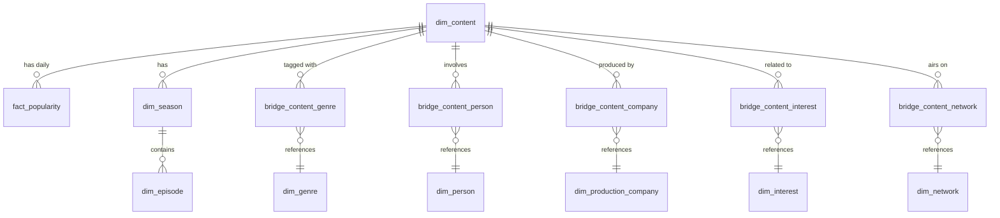

# Data Catalog — Dimensional Model

This document describes the dimensional model used in the gold layer of the `oruc-imdb-lake` S3 bucket. Data is cataloged by the Glue `gold-crawler` and queryable via Athena.

---

## Entity Relationship Overview

---

## Dimension Tables

### dim_content
> 1 row = 1 movie or TV series

| Column | Type | Description |
|--------|------|-------------|
| `content_id` | STRING | **PK** — IMDB ID (e.g. `tt1234567`) |
| `content_type` | STRING | `movie` or `tvSeries` |
| `primary_title` | STRING | Display title |
| `original_title` | STRING | Original language title |
| `overview` | STRING | Plot summary |
| `release_date` | STRING | Release date (movies) |
| `runtime_minutes` | INT | Runtime in minutes (movies) |
| `status` | STRING | `Released`, `Returning Series`, etc. |
| `original_language` | STRING | ISO language code (e.g. `en`) |
| `trailer` | STRING | Trailer URL |
| `content_poster` | STRING | Primary image URL |
| `average_rating` | DOUBLE | IMDB average rating |
| `vote_count` | INT | IMDB vote count |
| `content_homepage` | STRING | Official homepage URL |
| `tagline` | STRING | Movie/series tagline |
| `budget` | BIGINT | Production budget (movies only) |
| `revenue` | BIGINT | Box office revenue (movies only) |
| `created_at` | TIMESTAMP | Record creation time |
| `updated_at` | TIMESTAMP | Record last update time |

**Referenced by**: `fact_popularity`, `dim_season`, all bridge tables

---

### dim_season
> 1 row = 1 season of a TV series

| Column | Type | Description |
|--------|------|-------------|
| `season_key` | STRING | **PK** — Composite key: `{content_id}_S{season_number}` |
| `content_id` | STRING | **FK** → `dim_content.content_id` |
| `season_number` | INT | Season number |
| `name` | STRING | Season title |
| `overview` | STRING | Season summary |
| `air_date` | STRING | First air date |
| `episode_count` | INT | Number of episodes |
| `poster_path` | STRING | Season poster URL |

---

### dim_episode
> 1 row = 1 episode of a TV season

| Column | Type | Description |
|--------|------|-------------|
| `episode_key` | STRING | **PK** — `{content_id}_S{season}_E{episode}` |
| `season_key` | STRING | **FK** → `dim_season.season_key` |
| `content_id` | STRING | **FK** → `dim_content.content_id` |
| `season_number` | INT | Season number |
| `episode_number` | INT | Episode number |
| `primary_title` | STRING | Episode title (IMDB) |
| `original_title` | STRING | Original episode title (IMDB) |
| `runtime_minutes` | INT | Episode runtime (IMDB) |
| `average_rating` | DOUBLE | Episode rating (IMDB) |
| `vote_count` | INT | Episode vote count (IMDB) |
| `still_path` | STRING | Episode still image URL (TMDB) |
| `episode_type` | STRING | Episode type (TMDB) |
| `air_date` | STRING | Air date (TMDB) |

---

### dim_person
> 1 row = 1 unique person (actor, director, creator, etc.)

| Column | Type | Description |
|--------|------|-------------|
| `person_id` | STRING | **PK** — IMDB person ID (e.g. `nm0000001`) |
| `person_name` | STRING | Full name |
| `person_homepage` | STRING | IMDB profile URL |
| `person_poster` | STRING | Profile image URL |

---

### dim_genre
> 1 row = 1 genre

| Column | Type | Description |
|--------|------|-------------|
| `genre_name` | STRING | **PK** — Genre name (e.g. `Action`, `Drama`) |

---

### dim_production_company
> 1 row = 1 production company

| Column | Type | Description |
|--------|------|-------------|
| `company_id` | STRING | **PK** — TMDB company ID |
| `company_name` | STRING | Company name |
| `company_poster` | STRING | Company logo URL |

---

### dim_interest
> 1 row = 1 IMDB interest tag

| Column | Type | Description |
|--------|------|-------------|
| `interest_name` | STRING | **PK** — Interest/tag name |

---

### dim_network
> 1 row = 1 TV network (TV series only)

| Column | Type | Description |
|--------|------|-------------|
| `network_id` | STRING | **PK** — TMDB network ID |
| `network_name` | STRING | Network name (e.g. `Netflix`, `HBO`) |
| `network_poster` | STRING | Network logo URL |

---

## Bridge Tables

These implement many-to-many relationships between `dim_content` and other dimensions.

### bridge_content_genre

| Column | Type | Description |
|--------|------|-------------|
| `content_id` | STRING | **FK** → `dim_content` |
| `genre_name` | STRING | **FK** → `dim_genre` |

### bridge_content_person

| Column | Type | Description |
|--------|------|-------------|
| `content_id` | STRING | **FK** → `dim_content` |
| `person_id` | STRING | **FK** → `dim_person` |
| `role_type` | STRING | Role: `actor`, `director`, `creator`, etc. |
| `character_names` | ARRAY\<STRING\> | Character names (actors only) |
| `order_no` | INT | Billing/cast order |

### bridge_content_company

| Column | Type | Description |
|--------|------|-------------|
| `content_id` | STRING | **FK** → `dim_content` |
| `company_id` | STRING | **FK** → `dim_production_company` |

### bridge_content_interest

| Column | Type | Description |
|--------|------|-------------|
| `content_id` | STRING | **FK** → `dim_content` |
| `interest_name` | STRING | **FK** → `dim_interest` |

### bridge_content_network

| Column | Type | Description |
|--------|------|-------------|
| `content_id` | STRING | **FK** → `dim_content` |
| `network_id` | STRING | **FK** → `dim_network` |

---

## Fact Table

### fact_popularity
> 1 row = 1 content item per day. Partitioned by `loadDate`.

| Column | Type | Description |
|--------|------|-------------|
| `loadDate` | DATE | **Partition key** — Snapshot date |
| `content_id` | STRING | **FK** → `dim_content.content_id` |
| `rank` | INT | Daily popularity rank (1 = most popular). `NULL` for leavers. |
| `popularity` | DECIMAL(10,2) | TMDB popularity score |
| `rank_change` | INT | Rank delta vs. previous day. Negative = improved, `0` = new joiner, `999` = dropped out |
| `is_new_joiner` | BOOLEAN | `true` if content was not in yesterday's list |
| `is_leaver` | BOOLEAN | `true` if content dropped off the list today |

---

## API Sources

| API | Base URL | Used For |
|-----|----------|----------|
| **IMDB** (RapidAPI) | `https://imdb236.p.rapidapi.com/api/imdb` | Content metadata, cast, episodes, ratings |
| **TMDB** | `https://api.themoviedb.org/3` | Popularity, overview, production companies, networks, seasons |
